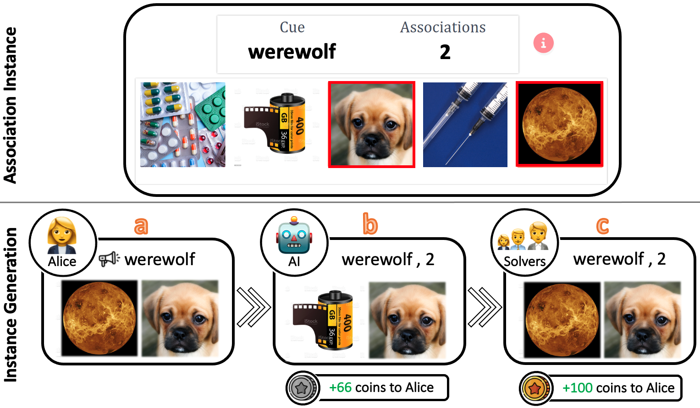

# WinoGAViL: Gamified Association Benchmark To Challenge Vision-And-Language Models

Repository for the paper "WinoGAViL: Gamified Association Benchmark To Challenge Vision-And-Language Models".  
Project website: https://winogavil.github.io/. Dataset is available to [explore](https://winogavil.github.io/explore) and [download](https://winogavil.github.io/download).     



## Abstract
While vision-and-language models perform well on tasks such as visual question answering, they struggle when it comes to basic human commonsense reasoning skills. In this work, we introduce WinoGAViL: an online game to collect vision-and-language associations, (e.g., werewolves to a full moon), used as a dynamic benchmark to evaluate state-of-the-art models. Inspired by the popular card game Codenames, a spymaster gives a textual cue related to several visual candidates, and another player has to identify them. Human players are rewarded for creating associations that are challenging for a rival AI model but still solvable by other human players. We use the game to collect 3.5K instances, finding that they are intuitive for humans (>90% Jaccard index) but challenging for state-of-the-art AI models, where the best model (ViLT) achieves a score of 52%, succeeding mostly where the cue is visually salient. Our analysis as well as the feedback we collect from players indicate that the collected associations require diverse reasoning skills, including general knowledge, common sense, abstraction, and more. We release the dataset, the code and the interactive game, aiming to allow future data collection that can be used to develop models with better association abilities.

## Setup
- Run:
    ```
    virtualenv venv 
    source venv/bin/activate
    pip install -r requirements.txt
    ```
- Run installation script:
    ```python
    python download-images.py 
    ```
  
## Experiments

`--split` argument allows running on the different splits, `--split game_10_12`, `--split game_5_6`, and `--split swow`

### Zero-Shot
To run zero-shot experiments, run:
```commandline
python run_zero_shot.py --split game_10_12  
```
`--models_to_run` argument allows running with specific model `--models_to_run ViLT`  

To run the image-captioning experiments (Table 6 in the paper), use the `--image2text` flag:
```commandline
python run_zero_shot.py --split game_10_12 --image2text 
```
`--models_to_run` argument allows running with specific model `--models_to_run ViLT`  


### Supervised
To run supervised experiments, run:
```commandline
python run_trainable.py --split game_10_12  
```

